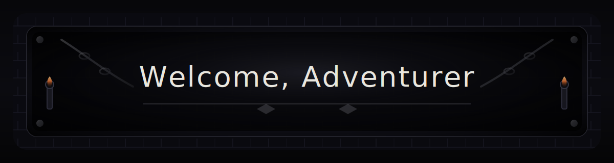
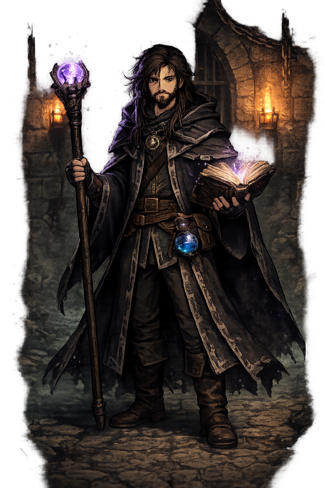

# Enter the Dungeon

### Hi, I'm **Yuicchi (David)**   
**Senior Developer at Espectra tecnologia** — forging tools for Service Desk, CRM, Dashboards & Omnichannel adventures.

 

---

## 📜 Tavern Notice Board
> *“Pull up a chair. Choose your quest.”*

- 🛠️ **Currently working:** building **Callsys** as a **Senior Developer**
- 🎯 **In search of the level:** **Software Engineering**
- 📈 **Grinding EXP:** becoming a stronger engineer every release, bug, and refactor

---

## 🧙 Character Sheet
| Attribute | Value |
|---|---|
| **Name** | Yuicchi (David) |
| **Class** | Full-Stack Adventurer |
| **Proficiency** | Code Healer |
| **Main Quest** | Crafting reliable systems with great UX |
| **Side Quests** | Open-source tools • UI polish • DevOps survival |

---

## Skill Tree

  
  
  
  

  
  
  
  

  
  
  

---